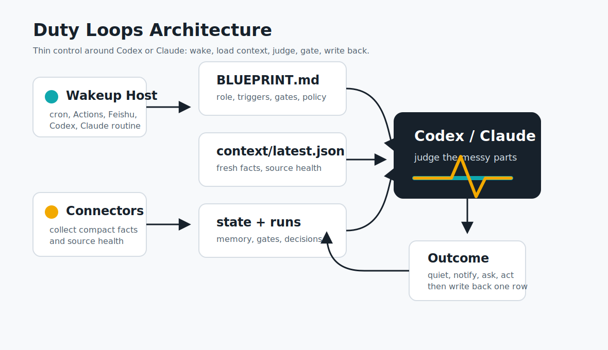
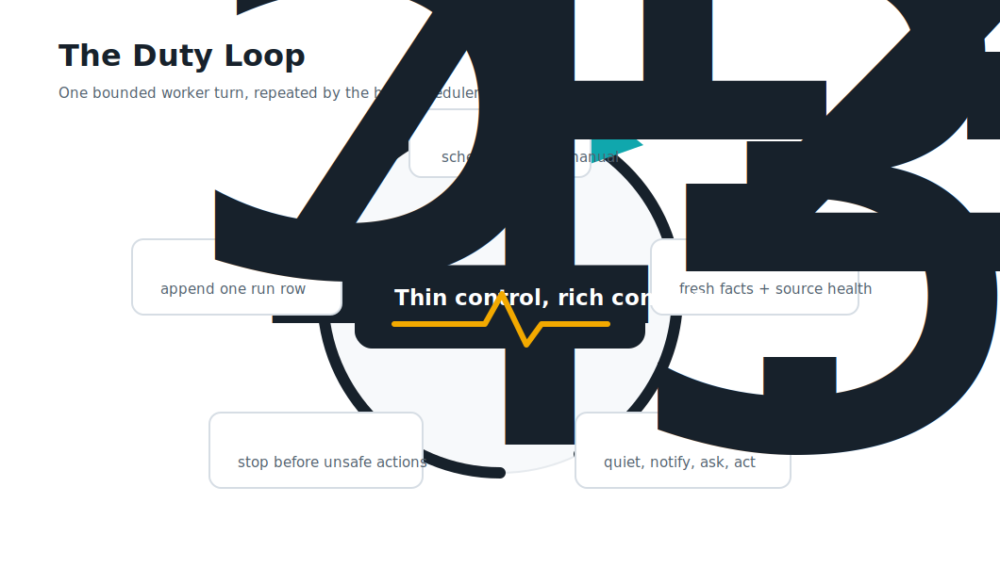
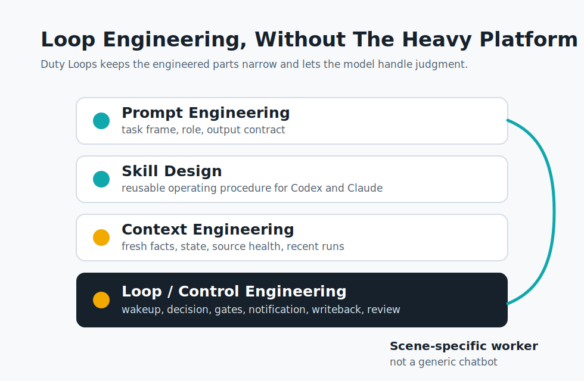

# Visual System

Duty Loops uses a restrained visual system: graphite for control, teal for
active loops and checkpoints, amber for signals that deserve attention.

## Logo

- [Logo mark](../assets/brand/logo.svg)
- [Logo mark PNG](../assets/brand/logo.png)
- [Horizontal logo](../assets/brand/logo-horizontal.svg)
- [Horizontal logo PNG](../assets/brand/logo-horizontal.png)
- [GitHub social preview PNG](../assets/brand/social-preview.png)
- [Bold concept sheet](../assets/brand/concepts/bold/logo-concept-sheet-bold-10.png)
- [Reserved 03 prismatic context concept](../assets/brand/concepts/bold/logo-03-prismatic-context.svg)
- [Selected 04 agent core concept crop](../assets/brand/concepts/bold/logo-04-agent-core.png)

The committed SVG logo is the maintained source of truth. It follows the 04
agent-core direction from the bold concept sheet. The 03 prismatic-context
direction is preserved as candidate material for future visual assets.

## Architecture

Use this diagram when explaining how a scheduler, connectors, Codex or Claude,
context, state, logs, and outcomes fit together.

## Control Loop

Use this diagram when explaining a single bounded worker turn.

## Method Stack

Use this diagram when explaining the relationship between prompt engineering,
skill design, context engineering, and loop/control engineering.
